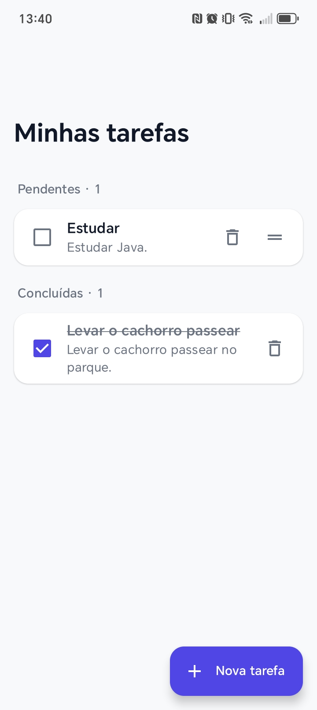
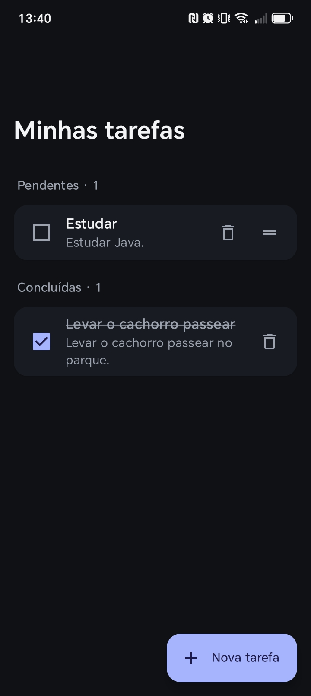
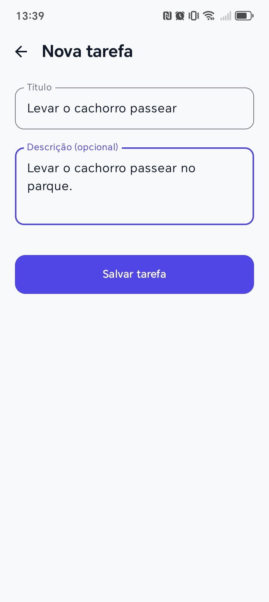

# Minhas Tarefas

Aplicativo mobile simples para organizar tarefas do dia a dia. Com ele você cadastra o que precisa fazer, acompanha o que ainda está pendente e marca como concluído o que já foi feito.

## Funcionalidades

- **Criar tarefas** com título e descrição opcional.
- **Listar tarefas** separadas em duas seções: **Pendentes** e **Concluídas**, cada uma com contador.
- **Marcar como concluída** com um toque na caixa de seleção (o título fica riscado e a tarefa vai para a seção *Concluídas*).
- **Desmarcar** uma tarefa concluída para voltar a *Pendentes*.
- **Excluir tarefas** pelo ícone de lixeira.
- **Reordenar tarefas pendentes** pelo ícone de arrastar.
- **Tema claro e escuro**, acompanhando a configuração do aparelho.

## Telas

### Lista de tarefas

Tela inicial, com as tarefas pendentes e concluídas.

|                                              Tema claro                                              | Tema escuro |
|:----------------------------------------------------------------------------------------------------:|:---:|
|  |  |

Com apenas uma tarefa pendente:

### Nova tarefa

Formulário para cadastrar uma tarefa: título, descrição (opcional) e o botão **Salvar tarefa**.

| Tema claro | Tema escuro |
|:---:|:---:|
|  |  |

## Como usar

1. Toque em **+ Nova tarefa**.
2. Preencha o **título** e, se quiser, a **descrição**.
3. Toque em **Salvar tarefa**.
4. Na lista, marque a caixa de seleção quando concluir a tarefa.
5. Use a lixeira para remover tarefas que não precisa mais.

